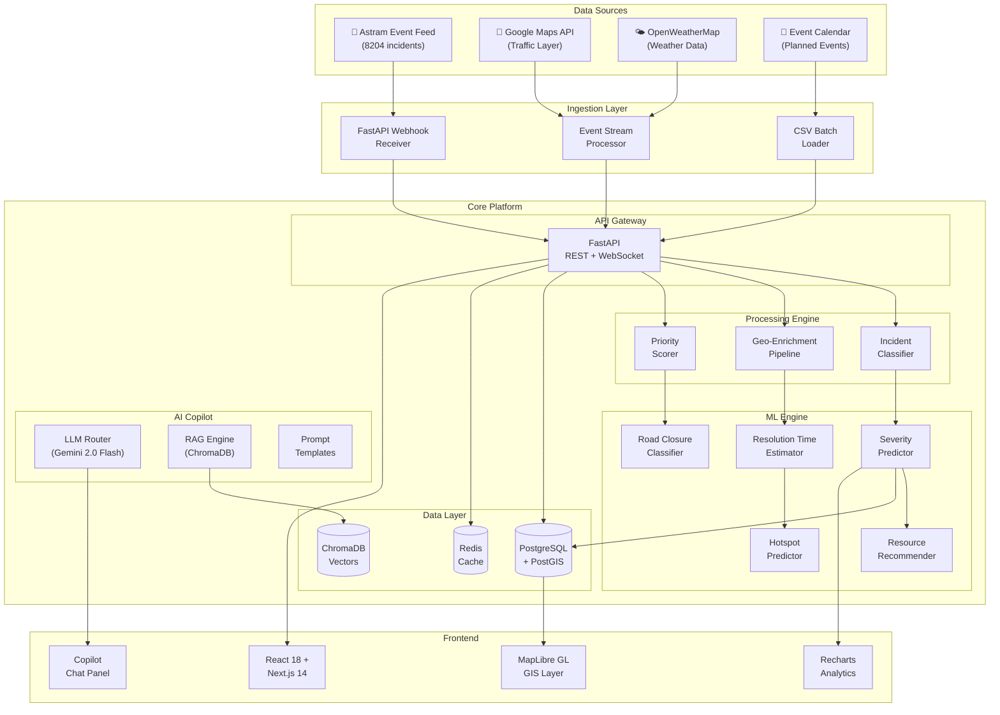
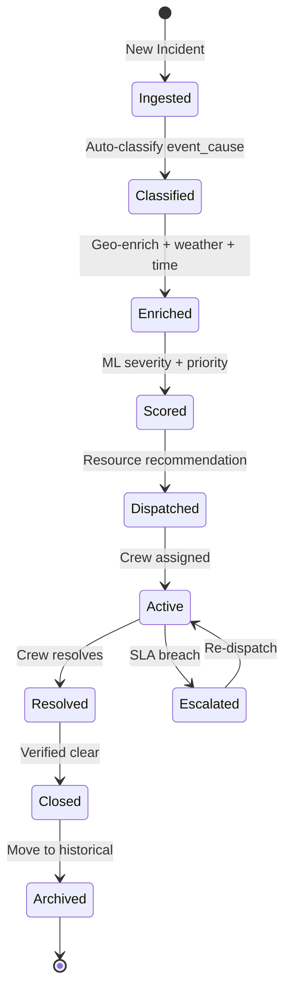
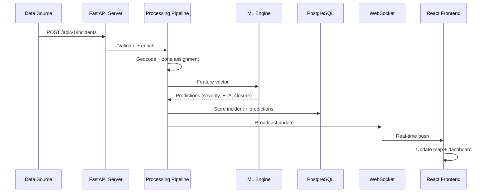
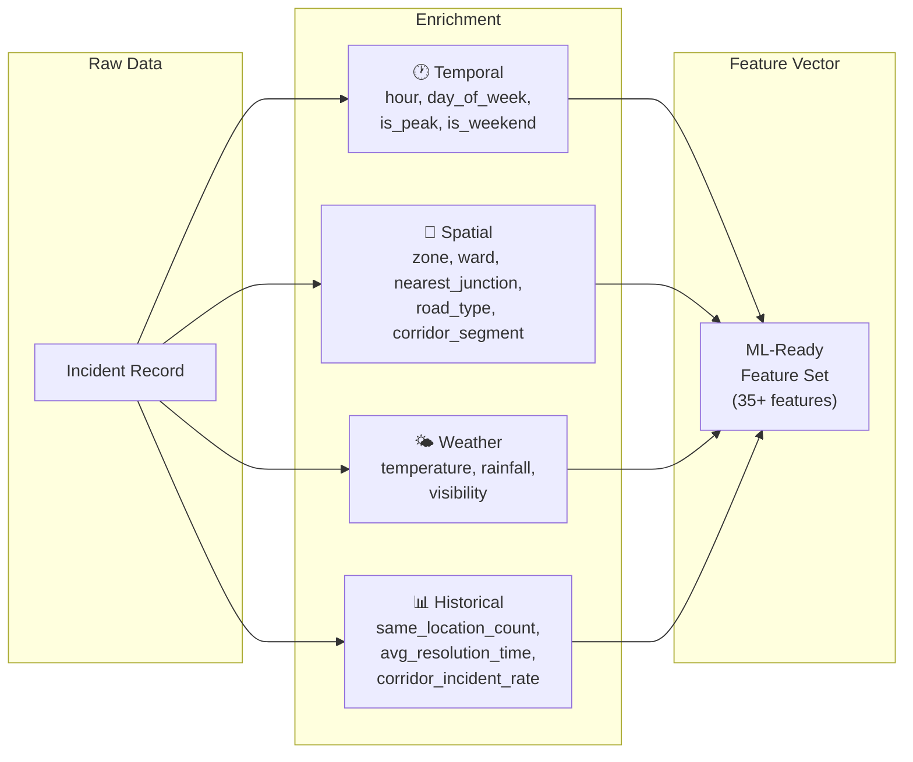
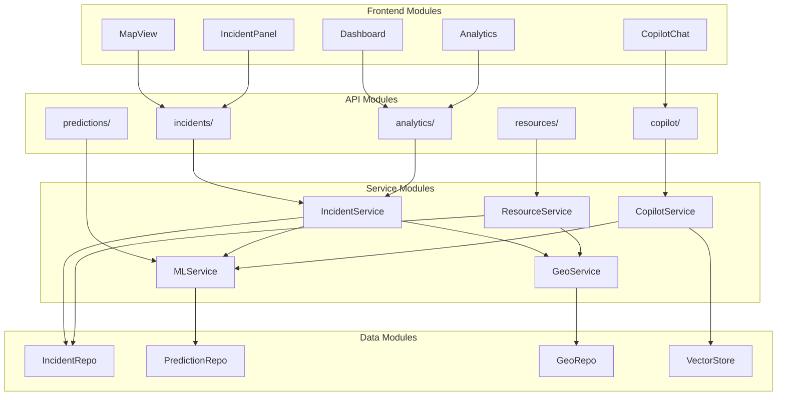

# 🏗️ Architecture Overview — NammaTraffic
## Bengaluru Traffic Incident Intelligence & Command Platform

> **Codename:** NammaTraffic ("Our Traffic" in Kannada)
> **For:** Flipkart Gridlock Hackathon 2.0 — Event-Driven Congestion
> **Version:** 1.0 | **Date:** June 2026

---

## 1. Product Vision

NammaTraffic is an **AI-powered traffic incident command platform** purpose-built for Bengaluru Traffic Police (BTP). It transforms reactive incident management into a **predictive, intelligent, and automated** operations center.

### The Problem We Solve

| Today (Manual) | NammaTraffic (Intelligent) |
|---|---|
| Incidents reported via phone/radio | Real-time incident ingestion + auto-classification |
| Dispatchers guess severity | ML predicts severity, resolution time, closure probability |
| No spatial awareness | Live GIS heatmaps with clustering + corridor analysis |
| Ad-hoc resource allocation | AI-recommended resource dispatch with ETAs |
| No institutional memory | RAG-powered copilot with historical pattern matching |
| Reactive traffic management | Predictive congestion alerts 30-60 min ahead |

### Core Capabilities

1. **Incident Command Center** — Real-time map with all active/predicted incidents
2. **Predictive Intelligence** — ML models for severity, resolution time, road closure probability
3. **AI Operations Copilot** — LLM-powered assistant with RAG over historical incidents
4. **Resource Optimizer** — Smart dispatch recommendations with geospatial routing
5. **Analytics & Replay** — Historical pattern analysis, corridor performance, zone dashboards

---

## 2. System Architecture

### 2.1 High-Level Architecture Diagram



### 2.2 Architecture Layers

```
┌─────────────────────────────────────────────────────────────────────┐
│                     PRESENTATION LAYER                              │
│  React 18 + Next.js 14 │ MapLibre GL │ TailwindCSS │ shadcn/ui    │
├─────────────────────────────────────────────────────────────────────┤
│                     API GATEWAY LAYER                               │
│  FastAPI │ WebSocket Manager │ JWT Auth │ Rate Limiter │ CORS      │
├─────────────────────────────────────────────────────────────────────┤
│                     BUSINESS LOGIC LAYER                            │
│  Incident Pipeline │ Geo-Enricher │ Priority Engine │ Dispatcher   │
├─────────────────────────────────────────────────────────────────────┤
│                     INTELLIGENCE LAYER                              │
│  scikit-learn Models │ XGBoost │ Gemini 2.0 Flash │ ChromaDB RAG  │
├─────────────────────────────────────────────────────────────────────┤
│                     DATA LAYER                                      │
│  PostgreSQL + PostGIS │ Redis │ ChromaDB │ CSV/Parquet Files       │
├─────────────────────────────────────────────────────────────────────┤
│                     INFRASTRUCTURE LAYER                            │
│  Docker Compose │ Nginx │ GitHub Actions │ Cloud VM               │
└─────────────────────────────────────────────────────────────────────┘
```

---

## 3. Data Flow Architecture

### 3.1 Incident Lifecycle



### 3.2 Real-Time Event Pipeline



---

## 4. Technology Stack

### 4.1 Complete Stack

| Layer | Technology | Why This Choice |
|---|---|---|
| **Frontend Framework** | Next.js 14 (App Router) | SSR for initial load, React Server Components |
| **UI Components** | shadcn/ui + TailwindCSS | Rapid prototyping, professional look |
| **Maps** | MapLibre GL JS + deck.gl | Open-source, GPU-accelerated, PostGIS integration |
| **Charts** | Recharts + Tremor | React-native charting, dashboard components |
| **Backend Framework** | FastAPI (Python 3.11+) | Async, auto-docs, type safety, ML ecosystem |
| **Real-Time** | WebSockets (FastAPI) | Sub-second incident updates |
| **Database** | PostgreSQL 16 + PostGIS 3.4 | Spatial queries, JSONB, mature ecosystem |
| **Cache** | Redis 7 | Session cache, real-time counters, pub/sub |
| **Vector DB** | ChromaDB | Lightweight, Python-native, perfect for RAG |
| **ML Framework** | scikit-learn + XGBoost | Fast training, interpretable, hackathon-friendly |
| **LLM** | Google Gemini 2.0 Flash | Fast, cheap, strong reasoning, multimodal |
| **Embeddings** | sentence-transformers (all-MiniLM-L6-v2) | Fast local embeddings for RAG |
| **Geocoding** | Nominatim (OSM) | Free, self-hostable, Bengaluru coverage |
| **Containerization** | Docker + Docker Compose | One-command deployment |
| **CI/CD** | GitHub Actions | Free, integrated |
| **Monitoring** | Prometheus + Grafana | Observability (stretch goal) |

### 4.2 Python Dependencies (Core)

```txt
# requirements.txt
fastapi==0.111.0
uvicorn[standard]==0.30.0
sqlalchemy==2.0.30
geoalchemy2==0.15.1
psycopg2-binary==2.9.9
alembic==1.13.1
redis==5.0.4
pydantic==2.7.1
scikit-learn==1.5.0
xgboost==2.0.3
pandas==2.2.2
numpy==1.26.4
shapely==2.0.4
geopandas==0.14.4
chromadb==0.5.0
sentence-transformers==3.0.0
google-generativeai==0.7.0
httpx==0.27.0
python-jose[cryptography]==3.3.0
python-multipart==0.0.9
websockets==12.0
```

### 4.3 Node.js Dependencies (Frontend)

```json
{
  "dependencies": {
    "next": "14.2.4",
    "react": "18.3.1",
    "react-dom": "18.3.1",
    "maplibre-gl": "4.5.0",
    "@deck.gl/core": "9.0.0",
    "@deck.gl/layers": "9.0.0",
    "@deck.gl/mapbox": "9.0.0",
    "recharts": "2.12.7",
    "@tremor/react": "3.17.4",
    "tailwindcss": "3.4.4",
    "@radix-ui/react-dialog": "1.1.0",
    "class-variance-authority": "0.7.0",
    "zustand": "4.5.2",
    "socket.io-client": "4.7.5",
    "date-fns": "3.6.0",
    "lucide-react": "0.396.0"
  }
}
```

---

## 5. Key Design Decisions

### 5.1 Architecture Decision Records (ADRs)

#### ADR-001: Monorepo over Microservices
- **Decision:** Single FastAPI monolith backend
- **Rationale:** 48-hour hackathon. Microservices add deployment complexity without proportional benefit at this scale. Modular code organization within monolith.
- **Consequence:** Faster development, simpler debugging, single Docker container.

#### ADR-002: PostGIS over MongoDB GeoJSON
- **Decision:** PostgreSQL + PostGIS for all spatial data
- **Rationale:** Native spatial indexing (R-tree), ST_DWithin for proximity queries, ST_ClusterDBSCAN for hotspot detection — all in SQL. Dataset is structured/relational.
- **Consequence:** Powerful spatial queries, standardized SQL, excellent Python ecosystem (GeoAlchemy2).

#### ADR-003: ChromaDB over Pinecone/Weaviate
- **Decision:** ChromaDB for vector storage (RAG)
- **Rationale:** Runs locally, zero external dependencies, Python-native, sufficient for 8204 incident embeddings. No API keys needed for vector operations.
- **Consequence:** Simple setup, fast iteration, but limited to single-node.

#### ADR-004: Gemini 2.0 Flash over GPT-4o
- **Decision:** Google Gemini 2.0 Flash for AI Copilot
- **Rationale:** Fastest in class, cheapest per token, excellent structured output, multimodal (can analyze traffic images), generous free tier.
- **Consequence:** Lower latency for copilot responses, cost-effective during demo.

#### ADR-005: MapLibre over Leaflet
- **Decision:** MapLibre GL JS for map rendering
- **Rationale:** WebGL-powered (handles 8000+ markers without jank), vector tiles, 3D support, open-source fork of Mapbox GL. deck.gl integration for advanced visualizations (hexgrid heatmaps, arc layers for diversions).
- **Consequence:** Smoother map experience, but slightly higher initial learning curve.

#### ADR-006: Server-Sent Events + WebSocket Hybrid
- **Decision:** WebSocket for bidirectional (copilot chat), SSE for unidirectional (incident feed)
- **Rationale:** SSE is simpler for one-way real-time incident updates, WebSocket needed only for interactive copilot.
- **Consequence:** Reduced connection overhead, browser-native SSE support.

---

## 6. Data Architecture

### 6.1 Dataset Profile

| Metric | Value |
|---|---|
| **Total Records** | 8,204 incidents |
| **Time Range** | Nov 2023 – May 2024 |
| **Event Types** | 2 (planned, unplanned — ~95% unplanned) |
| **Top Causes** | vehicle_breakdown (3800), accident (1200), tree_fall (600), road_work (500), protest (200) |
| **Geospatial** | lat/long pairs, 46 columns |
| **Corridors** | Tumkur Road, ORR East/West, Hosur Road, etc. |
| **Zones** | Multiple BTP zones |
| **Statuses** | open, closed, resolved |
| **Priorities** | High, Medium, Low |

### 6.2 Data Enrichment Strategy



---

## 7. Security Architecture

### 7.1 Authentication & Authorization

```
┌──────────────┐    ┌───────────────┐    ┌──────────────┐
│   Browser     │───▶│  Next.js       │───▶│  FastAPI      │
│   (JWT Token) │    │  Middleware     │    │  OAuth2       │
└──────────────┘    └───────────────┘    └──────────────┘
                                               │
                                         ┌─────┴─────┐
                                         │   Roles    │
                                         ├───────────┤
                                         │ ADMIN     │
                                         │ COMMANDER │
                                         │ OPERATOR  │
                                         │ VIEWER    │
                                         └───────────┘
```

### 7.2 Role-Based Access Control

| Role | Permissions |
|---|---|
| **Admin** | Full system access, user management, configuration |
| **Commander** | All incidents, dispatch, analytics, copilot |
| **Operator** | Assigned zone incidents, status updates, limited analytics |
| **Viewer** | Read-only dashboard, public analytics |

---

## 8. Scalability Considerations

### 8.1 Current Scale (Hackathon)
- **8,204 historical incidents** — fits in memory
- **Single PostgreSQL instance** — no sharding needed
- **Single FastAPI worker** — Uvicorn with 4 workers sufficient
- **ChromaDB in-process** — no separate server needed

### 8.2 Production Scale Path
- **100K+ incidents/year** — PostgreSQL partitioning by month
- **Real-time feeds** — Apache Kafka for event streaming
- **Multi-region** — Read replicas, CDN for frontend
- **ML at scale** — MLflow model registry, A/B testing
- **Kubernetes** — Container orchestration for auto-scaling

---

## 9. Module Dependency Graph



---

## 10. Performance Targets

| Metric | Target | Measurement |
|---|---|---|
| **Map Initial Load** | < 2s | Time to interactive map |
| **Incident Feed Latency** | < 500ms | WebSocket push delay |
| **ML Prediction** | < 200ms | Single incident scoring |
| **Copilot Response** | < 3s | First token from LLM |
| **API P95 Latency** | < 100ms | REST endpoint response |
| **Map Render (8K points)** | 60 FPS | MapLibre GL rendering |
| **Dashboard Refresh** | < 1s | Analytics panel update |

---

## 11. Cross-References

| Document | Purpose |
|---|---|
| [Frontend Architecture](./frontend_architecture.md) | React/Next.js component design, map layers |
| [Backend Architecture](./backend_architecture.md) | FastAPI services, event pipeline |
| [ML Architecture](./ml_architecture.md) | Model designs, feature engineering |
| [GIS Architecture](./gis_architecture.md) | Spatial layers, hotspot detection |
| [Database Schema](./database_schema.md) | PostgreSQL + PostGIS tables |
| [API Design](./api_design.md) | REST endpoints, WebSocket protocol |
| [Deployment Architecture](./deployment_architecture.md) | Docker, CI/CD, cloud |
| [AI Copilot Design](./ai_copilot_design.md) | LLM integration, RAG, prompts |
| [Demo Script](./demo_script.md) | 5-minute judge demo flow |
| [24-Hour Plan](./24_hour_plan.md) | First sprint plan |
| [48-Hour Plan](./48_hour_plan.md) | Full build plan |
| [Final Submission Checklist](./final_submission_checklist.md) | Submission requirements |

---

*This architecture is designed to be built by a small team in 48 hours while producing a product that could realistically be deployed by Bengaluru Traffic Police. Every decision optimizes for demo impact, technical depth, and real-world applicability.*
