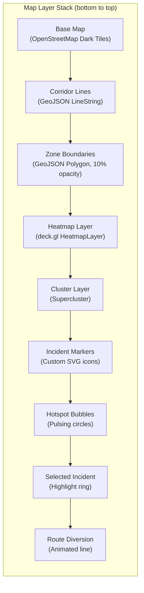

# 🎨 Frontend Architecture — NammaTraffic
## React + Next.js Command Center UI

> **Framework:** Next.js 14 (App Router) + React 18
> **Maps:** MapLibre GL JS + deck.gl
> **UI System:** TailwindCSS + shadcn/ui + Tremor
> **State:** Zustand + React Query (TanStack)

---

## 1. Design Philosophy

> *"A traffic command center, not a dashboard. Every pixel serves an operator under pressure."*

### Design Principles
1. **Glanceability** — Critical info visible without interaction
2. **Spatial-First** — Map is the primary interface, everything else is contextual
3. **Progressive Disclosure** — Summary → Detail on demand
4. **Dark Mode Default** — Reduce eye strain for 24/7 operations
5. **Color = Meaning** — Red=Critical, Amber=High, Yellow=Medium, Green=Clear

### Color System (Dark Theme)

```css
:root {
  /* Backgrounds */
  --bg-primary: #0a0a0f;      /* Deep navy-black */
  --bg-secondary: #111827;     /* Panels */
  --bg-card: #1f2937;          /* Cards */
  --bg-elevated: #374151;      /* Elevated surfaces */

  /* Severity Colors */
  --critical: #ef4444;         /* Red — Critical */
  --high: #f97316;             /* Orange — High */
  --medium: #eab308;           /* Yellow — Medium */
  --low: #22c55e;              /* Green — Low */
  --info: #3b82f6;             /* Blue — Info */

  /* Incident Type Colors */
  --accident: #ef4444;
  --vehicle-breakdown: #f97316;
  --tree-fall: #84cc16;
  --road-work: #eab308;
  --protest: #a855f7;
  --others: #6b7280;

  /* Status Colors */
  --status-open: #ef4444;
  --status-active: #f97316;
  --status-dispatched: #3b82f6;
  --status-resolved: #22c55e;
  --status-closed: #6b7280;

  /* Text */
  --text-primary: #f9fafb;
  --text-secondary: #9ca3af;
  --text-muted: #6b7280;

  /* Accents */
  --accent-primary: #3b82f6;
  --accent-glow: rgba(59, 130, 246, 0.3);
}
```

---

## 2. Application Layout

### 2.1 Screen Layout (Command Center Mode)

```
┌──────────────────────────────────────────────────────────────────────┐
│ ██ NammaTraffic │ 🔴 12 Critical │ 🟠 34 Active │ 🟢 8142 Resolved  │ ⚙️ │
├───────────┬──────────────────────────────────────┬───────────────────┤
│           │                                      │                   │
│  INCIDENT │                                      │   AI COPILOT      │
│  LIST     │          MAP VIEW                    │   CHAT PANEL      │
│  PANEL    │          (MapLibre GL)               │                   │
│           │                                      │   ┌─────────────┐ │
│  [Filter] │     🔴  🟠                          │   │ "What's the │ │
│  [Search] │        🟡  🔴                       │   │  status of  │ │
│           │     🟠     🔴                       │   │  ORR East?" │ │
│  ┌──────┐ │          🟡                         │   └─────────────┘ │
│  │Acc.. │ │     🔴        🟠                    │                   │
│  │High  │ │                                      │   💬 ORR East has │
│  │ORR E │ │                                      │   3 active inc... │
│  └──────┘ │                                      │                   │
│  ┌──────┐ │                                      │                   │
│  │Brkdn │ │                                      │                   │
│  │Med   │ │                                      │                   │
│  └──────┘ │                                      │                   │
│           │──────────────────────────────────────│                   │
│           │  ANALYTICS BAR (Collapsible)         │                   │
│           │  [Timeline] [By Cause] [By Corridor] │                   │
├───────────┴──────────────────────────────────────┴───────────────────┤
│  Status: Connected │ Last Update: 2s ago │ ML Models: Active │ v1.0  │
└──────────────────────────────────────────────────────────────────────┘
```

### 2.2 Responsive Breakpoints

| Breakpoint | Layout | Use Case |
|---|---|---|
| **xl (1440px+)** | 3-column: List + Map + Copilot | Command center display |
| **lg (1024-1439px)** | 2-column: Map + Side panel (toggle List/Copilot) | Laptop |
| **md (768-1023px)** | Full-width map + bottom sheet | Tablet |
| **sm (<768px)** | Mobile-first stack | Field officer phone |

---

## 3. Component Architecture

### 3.1 Component Tree

```mermaid
graph TD
    App["App (RootLayout)"]
    
    App --> Providers["Providers<br/>(QueryClient, WebSocket, Store)"]
    Providers --> CommandCenter["CommandCenter<br/>(Main Layout)"]
    
    CommandCenter --> TopBar["TopBar"]
    CommandCenter --> LeftPanel["LeftPanel"]
    CommandCenter --> MapContainer["MapContainer"]
    CommandCenter --> RightPanel["RightPanel"]
    CommandCenter --> BottomBar["BottomBar"]
    
    TopBar --> Logo["Logo + Title"]
    TopBar --> LiveCounters["LiveCounters"]
    TopBar --> SearchBar["GlobalSearch"]
    TopBar --> UserMenu["UserMenu"]
    
    LeftPanel --> IncidentFilters["IncidentFilters"]
    LeftPanel --> IncidentList["IncidentList"]
    IncidentList --> IncidentCard["IncidentCard (×N)"]
    
    MapContainer --> MapView["MapView (MapLibre)"]
    MapContainer --> MapControls["MapControls"]
    MapContainer --> MapLayers["MapLayers"]
    MapView --> IncidentMarkers["IncidentMarkers"]
    MapView --> HeatmapLayer["HeatmapLayer"]
    MapView --> ClusterLayer["ClusterLayer"]
    MapView --> CorridorOverlay["CorridorOverlay"]
    MapView --> HotspotBubbles["HotspotBubbles"]
    MapControls --> LayerToggle["LayerToggle"]
    MapControls --> TimeSlider["TimeSlider"]
    MapControls --> ZoomControls["ZoomControls"]
    
    RightPanel --> CopilotChat["CopilotChat"]
    RightPanel --> IncidentDetail["IncidentDetail"]
    CopilotChat --> ChatMessages["ChatMessages"]
    CopilotChat --> ChatInput["ChatInput"]
    CopilotChat --> QuickActions["QuickActions"]
    
    IncidentDetail --> DetailHeader["DetailHeader"]
    IncidentDetail --> PredictionCards["PredictionCards"]
    IncidentDetail --> ResourcePanel["ResourcePanel"]
    IncidentDetail --> TimelineView["TimelineView"]
    
    BottomBar --> AnalyticsStrip["AnalyticsStrip"]
    AnalyticsStrip --> TimelineChart["TimelineChart"]
    AnalyticsStrip --> CauseDistChart["CauseDistChart"]
    AnalyticsStrip --> CorridorChart["CorridorChart"]
```



### 3.2 Core Component Specifications

#### `<CommandCenter />` — Root Layout

```tsx
// app/page.tsx
"use client";

import { CommandCenter } from "@/components/command-center";
import { Providers } from "@/components/providers";

export default function HomePage() {
  return (
    <Providers>
      <CommandCenter />
    </Providers>
  );
}
```

```tsx
// components/command-center.tsx
"use client";

import { useState } from "react";
import { TopBar } from "./top-bar";
import { LeftPanel } from "./left-panel";
import { MapContainer } from "./map/map-container";
import { RightPanel } from "./right-panel";
import { BottomBar } from "./bottom-bar";
import { useIncidentStore } from "@/stores/incident-store";

export function CommandCenter() {
  const [rightPanelMode, setRightPanelMode] = useState<"copilot" | "detail">("copilot");
  const selectedIncident = useIncidentStore((s) => s.selectedIncident);

  return (
    <div className="h-screen w-screen flex flex-col bg-bg-primary text-text-primary overflow-hidden">
      <TopBar />
      
      <div className="flex-1 flex overflow-hidden">
        {/* Left: Incident List */}
        <aside className="w-80 border-r border-gray-800 flex flex-col">
          <LeftPanel />
        </aside>

        {/* Center: Map */}
        <main className="flex-1 relative">
          <MapContainer />
          <BottomBar />
        </main>

        {/* Right: Copilot / Detail */}
        <aside className="w-96 border-l border-gray-800 flex flex-col">
          <RightPanel 
            mode={selectedIncident ? "detail" : "copilot"} 
            onModeChange={setRightPanelMode}
          />
        </aside>
      </div>
    </div>
  );
}
```

#### `<LiveCounters />` — Real-Time Status Bar

```tsx
// components/top-bar/live-counters.tsx
"use client";

import { useIncidentStore } from "@/stores/incident-store";
import { Badge } from "@/components/ui/badge";
import { motion, AnimatePresence } from "framer-motion";

export function LiveCounters() {
  const counts = useIncidentStore((s) => s.counts);

  return (
    <div className="flex items-center gap-4">
      <CounterBadge
        label="Critical"
        count={counts.critical}
        color="bg-red-500"
        pulse={counts.critical > 0}
      />
      <CounterBadge
        label="Active"
        count={counts.active}
        color="bg-orange-500"
      />
      <CounterBadge
        label="Dispatched"
        count={counts.dispatched}
        color="bg-blue-500"
      />
      <CounterBadge
        label="Resolved Today"
        count={counts.resolvedToday}
        color="bg-green-500"
      />
    </div>
  );
}

function CounterBadge({ label, count, color, pulse }: {
  label: string;
  count: number;
  color: string;
  pulse?: boolean;
}) {
  return (
    <div className="flex items-center gap-2">
      <span className="relative flex h-3 w-3">
        {pulse && (
          <span className={`animate-ping absolute inline-flex h-full w-full rounded-full ${color} opacity-75`} />
        )}
        <span className={`relative inline-flex rounded-full h-3 w-3 ${color}`} />
      </span>
      <AnimatePresence mode="popLayout">
        <motion.span
          key={count}
          initial={{ y: -10, opacity: 0 }}
          animate={{ y: 0, opacity: 1 }}
          exit={{ y: 10, opacity: 0 }}
          className="font-mono font-bold text-lg"
        >
          {count}
        </motion.span>
      </AnimatePresence>
      <span className="text-text-secondary text-sm">{label}</span>
    </div>
  );
}
```

---

## 4. Map Architecture

### 4.1 Map Layer Stack



### 4.2 MapLibre Integration

```tsx
// components/map/map-view.tsx
"use client";

import { useRef, useEffect, useCallback } from "react";
import maplibregl from "maplibre-gl";
import { useIncidentStore } from "@/stores/incident-store";

const BENGALURU_CENTER: [number, number] = [77.5946, 12.9716];
const INITIAL_ZOOM = 11.5;

// Dark basemap style
const MAP_STYLE = {
  version: 8 as const,
  sources: {
    osm: {
      type: "raster" as const,
      tiles: [
        "https://tiles.stadiamaps.com/tiles/alidade_smooth_dark/{z}/{x}/{y}@2x.png"
      ],
      tileSize: 512,
      attribution: "© Stadia Maps © OpenMapTiles © OpenStreetMap",
    },
  },
  layers: [
    {
      id: "osm",
      type: "raster" as const,
      source: "osm",
    },
  ],
};

export function MapView() {
  const mapContainer = useRef<HTMLDivElement>(null);
  const map = useRef<maplibregl.Map | null>(null);
  const incidents = useIncidentStore((s) => s.activeIncidents);

  useEffect(() => {
    if (!mapContainer.current) return;

    map.current = new maplibregl.Map({
      container: mapContainer.current,
      style: MAP_STYLE,
      center: BENGALURU_CENTER,
      zoom: INITIAL_ZOOM,
      pitch: 30,
      bearing: -15,
      maxBounds: [
        [77.2, 12.7],  // SW corner
        [78.0, 13.2],  // NE corner
      ],
    });

    map.current.addControl(new maplibregl.NavigationControl(), "top-right");
    map.current.addControl(new maplibregl.ScaleControl(), "bottom-left");

    map.current.on("load", () => {
      addIncidentSource();
      addIncidentLayers();
      addCorridorLayers();
    });

    return () => map.current?.remove();
  }, []);

  // Update incidents on source when data changes
  useEffect(() => {
    if (!map.current?.getSource("incidents")) return;
    const source = map.current.getSource("incidents") as maplibregl.GeoJSONSource;
    source.setData(incidentsToGeoJSON(incidents));
  }, [incidents]);

  const addIncidentSource = useCallback(() => {
    map.current!.addSource("incidents", {
      type: "geojson",
      data: incidentsToGeoJSON(incidents),
      cluster: true,
      clusterMaxZoom: 14,
      clusterRadius: 50,
    });
  }, []);

  const addIncidentLayers = useCallback(() => {
    // Clustered circles
    map.current!.addLayer({
      id: "clusters",
      type: "circle",
      source: "incidents",
      filter: ["has", "point_count"],
      paint: {
        "circle-color": [
          "step", ["get", "point_count"],
          "#3b82f6", 10,
          "#f97316", 30,
          "#ef4444"
        ],
        "circle-radius": [
          "step", ["get", "point_count"],
          20, 10, 30, 30, 40
        ],
        "circle-opacity": 0.85,
        "circle-stroke-width": 2,
        "circle-stroke-color": "#fff",
        "circle-stroke-opacity": 0.4,
      },
    });

    // Cluster count labels
    map.current!.addLayer({
      id: "cluster-count",
      type: "symbol",
      source: "incidents",
      filter: ["has", "point_count"],
      layout: {
        "text-field": "{point_count_abbreviated}",
        "text-font": ["Open Sans Bold"],
        "text-size": 14,
      },
      paint: { "text-color": "#ffffff" },
    });

    // Individual incident points
    map.current!.addLayer({
      id: "unclustered-point",
      type: "circle",
      source: "incidents",
      filter: ["!", ["has", "point_count"]],
      paint: {
        "circle-color": [
          "match", ["get", "priority"],
          "High", "#ef4444",
          "Medium", "#eab308",
          "Low", "#22c55e",
          "#6b7280"
        ],
        "circle-radius": [
          "match", ["get", "priority"],
          "High", 8,
          "Medium", 6,
          "Low", 5,
          5
        ],
        "circle-stroke-width": 2,
        "circle-stroke-color": "#ffffff",
        "circle-stroke-opacity": 0.6,
      },
    });
  }, []);

  return (
    <div ref={mapContainer} className="w-full h-full" />
  );
}

function incidentsToGeoJSON(incidents: Incident[]): GeoJSON.FeatureCollection {
  return {
    type: "FeatureCollection",
    features: incidents.map((inc) => ({
      type: "Feature",
      geometry: {
        type: "Point",
        coordinates: [inc.longitude, inc.latitude],
      },
      properties: {
        id: inc.id,
        event_cause: inc.event_cause,
        priority: inc.priority,
        status: inc.status,
        requires_road_closure: inc.requires_road_closure,
      },
    })),
  };
}
```

### 4.3 deck.gl Heatmap Layer

```tsx
// components/map/layers/heatmap-layer.tsx
import { HeatmapLayer } from "@deck.gl/aggregation-layers";
import { MapboxOverlay } from "@deck.gl/mapbox";

export function createHeatmapLayer(incidents: Incident[]) {
  return new HeatmapLayer({
    id: "incident-heatmap",
    data: incidents,
    getPosition: (d: Incident) => [d.longitude, d.latitude],
    getWeight: (d: Incident) => {
      const weights = { High: 3, Medium: 2, Low: 1 };
      return weights[d.priority] || 1;
    },
    radiusPixels: 60,
    intensity: 1.5,
    threshold: 0.1,
    colorRange: [
      [65, 182, 196],   // Cool
      [127, 205, 187],
      [199, 233, 180],
      [237, 248, 177],
      [255, 237, 160],
      [254, 178, 76],
      [253, 141, 60],
      [240, 59, 32],    // Hot
    ],
    opacity: 0.6,
  });
}
```

### 4.4 Incident Marker Icons (SVG)

```tsx
// components/map/markers/incident-icon.tsx

export const INCIDENT_ICONS = {
  accident: `<svg width="24" height="24" viewBox="0 0 24 24">
    <circle cx="12" cy="12" r="10" fill="#ef4444" stroke="#fff" stroke-width="2"/>
    <path d="M12 7v6M12 15.5v.5" stroke="#fff" stroke-width="2" stroke-linecap="round"/>
  </svg>`,
  
  vehicle_breakdown: `<svg width="24" height="24" viewBox="0 0 24 24">
    <circle cx="12" cy="12" r="10" fill="#f97316" stroke="#fff" stroke-width="2"/>
    <path d="M8 12h8M12 8v8" stroke="#fff" stroke-width="2" stroke-linecap="round"/>
  </svg>`,
  
  tree_fall: `<svg width="24" height="24" viewBox="0 0 24 24">
    <circle cx="12" cy="12" r="10" fill="#84cc16" stroke="#fff" stroke-width="2"/>
    <path d="M12 6l4 6h-3v6h-2v-6H8l4-6z" fill="#fff"/>
  </svg>`,
  
  road_work: `<svg width="24" height="24" viewBox="0 0 24 24">
    <circle cx="12" cy="12" r="10" fill="#eab308" stroke="#fff" stroke-width="2"/>
    <path d="M10 7l4 10M14 7l-4 10" stroke="#fff" stroke-width="2"/>
  </svg>`,
  
  protest: `<svg width="24" height="24" viewBox="0 0 24 24">
    <circle cx="12" cy="12" r="10" fill="#a855f7" stroke="#fff" stroke-width="2"/>
    <path d="M8 16V8l8 4-8 4z" fill="#fff"/>
  </svg>`,
};
```

---

## 5. State Management

### 5.1 Zustand Stores

```tsx
// stores/incident-store.ts
import { create } from "zustand";
import { devtools, subscribeWithSelector } from "zustand/middleware";

interface IncidentStore {
  // Data
  activeIncidents: Incident[];
  selectedIncident: Incident | null;
  predictions: Record<string, Prediction>;
  
  // Filters
  filters: {
    causes: string[];
    priorities: string[];
    statuses: string[];
    corridors: string[];
    zones: string[];
    dateRange: [Date, Date] | null;
    searchQuery: string;
  };
  
  // Counts
  counts: {
    total: number;
    critical: number;
    active: number;
    dispatched: number;
    resolvedToday: number;
  };
  
  // Actions
  setIncidents: (incidents: Incident[]) => void;
  selectIncident: (incident: Incident | null) => void;
  updateFilter: (key: string, value: any) => void;
  resetFilters: () => void;
  
  // Computed
  filteredIncidents: () => Incident[];
}

export const useIncidentStore = create<IncidentStore>()(
  devtools(
    subscribeWithSelector((set, get) => ({
      activeIncidents: [],
      selectedIncident: null,
      predictions: {},
      
      filters: {
        causes: [],
        priorities: [],
        statuses: ["open", "active", "dispatched"],
        corridors: [],
        zones: [],
        dateRange: null,
        searchQuery: "",
      },
      
      counts: {
        total: 0,
        critical: 0,
        active: 0,
        dispatched: 0,
        resolvedToday: 0,
      },
      
      setIncidents: (incidents) => set({
        activeIncidents: incidents,
        counts: computeCounts(incidents),
      }),
      
      selectIncident: (incident) => set({ selectedIncident: incident }),
      
      updateFilter: (key, value) => set((state) => ({
        filters: { ...state.filters, [key]: value },
      })),
      
      resetFilters: () => set((state) => ({
        filters: {
          causes: [],
          priorities: [],
          statuses: ["open", "active", "dispatched"],
          corridors: [],
          zones: [],
          dateRange: null,
          searchQuery: "",
        },
      })),
      
      filteredIncidents: () => {
        const { activeIncidents, filters } = get();
        return activeIncidents.filter((inc) => {
          if (filters.causes.length && !filters.causes.includes(inc.event_cause)) return false;
          if (filters.priorities.length && !filters.priorities.includes(inc.priority)) return false;
          if (filters.statuses.length && !filters.statuses.includes(inc.status)) return false;
          if (filters.searchQuery && 
            !inc.description?.toLowerCase().includes(filters.searchQuery.toLowerCase()) &&
            !inc.address?.toLowerCase().includes(filters.searchQuery.toLowerCase())
          ) return false;
          return true;
        });
      },
    })),
    { name: "incident-store" }
  )
);

function computeCounts(incidents: Incident[]) {
  const today = new Date().toDateString();
  return {
    total: incidents.length,
    critical: incidents.filter((i) => i.priority === "High" && i.status === "open").length,
    active: incidents.filter((i) => ["open", "active"].includes(i.status)).length,
    dispatched: incidents.filter((i) => i.status === "dispatched").length,
    resolvedToday: incidents.filter((i) => 
      i.status === "resolved" && new Date(i.resolved_at).toDateString() === today
    ).length,
  };
}
```

### 5.2 React Query Integration

```tsx
// hooks/use-incidents.ts
import { useQuery, useMutation, useQueryClient } from "@tanstack/react-query";
import { api } from "@/lib/api";

export function useIncidents(filters?: IncidentFilters) {
  return useQuery({
    queryKey: ["incidents", filters],
    queryFn: () => api.getIncidents(filters),
    refetchInterval: 10_000,  // 10s polling
    staleTime: 5_000,
  });
}

export function useIncidentDetail(id: string) {
  return useQuery({
    queryKey: ["incident", id],
    queryFn: () => api.getIncident(id),
    enabled: !!id,
  });
}

export function usePrediction(incidentId: string) {
  return useQuery({
    queryKey: ["prediction", incidentId],
    queryFn: () => api.getPrediction(incidentId),
    enabled: !!incidentId,
    staleTime: 60_000,
  });
}

export function useUpdateIncidentStatus() {
  const queryClient = useQueryClient();
  return useMutation({
    mutationFn: ({ id, status }: { id: string; status: string }) =>
      api.updateIncidentStatus(id, status),
    onSuccess: () => {
      queryClient.invalidateQueries({ queryKey: ["incidents"] });
    },
  });
}
```

### 5.3 WebSocket Connection

```tsx
// hooks/use-websocket.ts
"use client";

import { useEffect, useRef, useCallback } from "react";
import { useIncidentStore } from "@/stores/incident-store";

const WS_URL = process.env.NEXT_PUBLIC_WS_URL || "ws://localhost:8000/ws/incidents";

export function useIncidentWebSocket() {
  const ws = useRef<WebSocket | null>(null);
  const setIncidents = useIncidentStore((s) => s.setIncidents);

  const connect = useCallback(() => {
    ws.current = new WebSocket(WS_URL);

    ws.current.onmessage = (event) => {
      const message = JSON.parse(event.data);
      
      switch (message.type) {
        case "incident_update":
          // Update single incident in store
          useIncidentStore.getState().updateIncident(message.data);
          break;
        case "incident_new":
          // Add new incident with animation trigger
          useIncidentStore.getState().addIncident(message.data);
          break;
        case "bulk_sync":
          // Full sync (initial load or reconnect)
          setIncidents(message.data);
          break;
        case "prediction_update":
          useIncidentStore.getState().updatePrediction(message.data);
          break;
      }
    };

    ws.current.onclose = () => {
      // Reconnect after 3 seconds
      setTimeout(connect, 3000);
    };
  }, []);

  useEffect(() => {
    connect();
    return () => ws.current?.close();
  }, [connect]);
}
```

---

## 6. Key UI Components

### 6.1 Incident Card

```tsx
// components/incident/incident-card.tsx
import { Badge } from "@/components/ui/badge";
import { Clock, MapPin, AlertTriangle, Truck } from "lucide-react";
import { formatDistanceToNow } from "date-fns";
import { cn } from "@/lib/utils";

const CAUSE_ICONS: Record<string, any> = {
  accident: AlertTriangle,
  vehicle_breakdown: Truck,
  tree_fall: TreePine,
  road_work: Construction,
  protest: Users,
};

const PRIORITY_STYLES = {
  High: "border-l-red-500 bg-red-500/5",
  Medium: "border-l-yellow-500 bg-yellow-500/5",
  Low: "border-l-green-500 bg-green-500/5",
};

export function IncidentCard({ incident, isSelected, onClick }: Props) {
  const Icon = CAUSE_ICONS[incident.event_cause] || AlertTriangle;
  const timeAgo = formatDistanceToNow(new Date(incident.start_datetime), { addSuffix: true });

  return (
    <div
      className={cn(
        "p-3 border-l-4 rounded-r-lg cursor-pointer transition-all",
        "hover:bg-gray-800/50",
        PRIORITY_STYLES[incident.priority],
        isSelected && "ring-1 ring-blue-500 bg-blue-500/10"
      )}
      onClick={() => onClick(incident)}
    >
      <div className="flex items-start justify-between">
        <div className="flex items-center gap-2">
          <Icon className="h-4 w-4 text-text-secondary" />
          <span className="font-medium text-sm capitalize">
            {incident.event_cause.replace("_", " ")}
          </span>
        </div>
        <Badge variant={incident.priority === "High" ? "destructive" : "secondary"}>
          {incident.priority}
        </Badge>
      </div>

      <p className="text-xs text-text-secondary mt-1 line-clamp-2">
        {incident.description || incident.address}
      </p>

      <div className="flex items-center gap-3 mt-2 text-xs text-text-muted">
        <span className="flex items-center gap-1">
          <Clock className="h-3 w-3" />
          {timeAgo}
        </span>
        <span className="flex items-center gap-1">
          <MapPin className="h-3 w-3" />
          {incident.corridor_id?.replace("_", " ") || "Non-corridor"}
        </span>
        {incident.requires_road_closure && (
          <Badge variant="outline" className="text-red-400 border-red-400/50 text-[10px]">
            ROAD CLOSED
          </Badge>
        )}
      </div>
    </div>
  );
}
```

### 6.2 Prediction Cards (ML Results)

```tsx
// components/incident/prediction-cards.tsx
import { Card, CardContent } from "@/components/ui/card";
import { Progress } from "@/components/ui/progress";

export function PredictionCards({ prediction }: { prediction: Prediction }) {
  return (
    <div className="grid grid-cols-2 gap-3">
      {/* Severity Score */}
      <Card className="bg-gray-900 border-gray-800">
        <CardContent className="p-3">
          <p className="text-xs text-text-secondary">Severity Score</p>
          <div className="flex items-end gap-2 mt-1">
            <span className="text-2xl font-bold text-red-400">
              {(prediction.severity_score * 100).toFixed(0)}
            </span>
            <span className="text-xs text-text-muted mb-1">/100</span>
          </div>
          <Progress 
            value={prediction.severity_score * 100} 
            className="mt-2 h-1.5"
            indicatorClassName={
              prediction.severity_score > 0.7 ? "bg-red-500" :
              prediction.severity_score > 0.4 ? "bg-yellow-500" : "bg-green-500"
            }
          />
        </CardContent>
      </Card>

      {/* Estimated Resolution Time */}
      <Card className="bg-gray-900 border-gray-800">
        <CardContent className="p-3">
          <p className="text-xs text-text-secondary">Est. Resolution</p>
          <div className="flex items-end gap-1 mt-1">
            <span className="text-2xl font-bold text-blue-400">
              {prediction.resolution_time_minutes.toFixed(0)}
            </span>
            <span className="text-xs text-text-muted mb-1">min</span>
          </div>
          <p className="text-[10px] text-text-muted mt-1">
            95% CI: {prediction.resolution_time_lower?.toFixed(0)}–
            {prediction.resolution_time_upper?.toFixed(0)} min
          </p>
        </CardContent>
      </Card>

      {/* Road Closure Probability */}
      <Card className="bg-gray-900 border-gray-800">
        <CardContent className="p-3">
          <p className="text-xs text-text-secondary">Closure Risk</p>
          <div className="flex items-end gap-1 mt-1">
            <span className={cn(
              "text-2xl font-bold",
              prediction.road_closure_probability > 0.7 ? "text-red-400" :
              prediction.road_closure_probability > 0.3 ? "text-yellow-400" : "text-green-400"
            )}>
              {(prediction.road_closure_probability * 100).toFixed(0)}%
            </span>
          </div>
        </CardContent>
      </Card>

      {/* Confidence */}
      <Card className="bg-gray-900 border-gray-800">
        <CardContent className="p-3">
          <p className="text-xs text-text-secondary">Model Confidence</p>
          <div className="flex items-end gap-1 mt-1">
            <span className="text-2xl font-bold text-purple-400">
              {(prediction.confidence * 100).toFixed(0)}%
            </span>
          </div>
          <p className="text-[10px] text-text-muted mt-1">
            v{prediction.model_version}
          </p>
        </CardContent>
      </Card>
    </div>
  );
}
```

### 6.3 Copilot Chat Interface

```tsx
// components/copilot/copilot-chat.tsx
"use client";

import { useState, useRef, useEffect } from "react";
import { Send, Sparkles, RotateCcw } from "lucide-react";
import { Button } from "@/components/ui/button";
import { Textarea } from "@/components/ui/textarea";
import { useCopilotChat } from "@/hooks/use-copilot";

const QUICK_PROMPTS = [
  "What's the current status of ORR East?",
  "Show me high-priority incidents needing attention",
  "Which corridor has the most breakdowns this week?",
  "Predict congestion for the next 2 hours",
  "Recommend resources for the selected incident",
  "Compare incident patterns: weekday vs weekend",
];

export function CopilotChat() {
  const [input, setInput] = useState("");
  const { messages, isLoading, sendMessage, resetChat } = useCopilotChat();
  const scrollRef = useRef<HTMLDivElement>(null);

  useEffect(() => {
    scrollRef.current?.scrollTo({ top: scrollRef.current.scrollHeight, behavior: "smooth" });
  }, [messages]);

  const handleSend = () => {
    if (!input.trim() || isLoading) return;
    sendMessage(input);
    setInput("");
  };

  return (
    <div className="flex flex-col h-full">
      {/* Header */}
      <div className="flex items-center justify-between p-3 border-b border-gray-800">
        <div className="flex items-center gap-2">
          <Sparkles className="h-5 w-5 text-purple-400" />
          <h3 className="font-semibold">AI Copilot</h3>
        </div>
        <Button variant="ghost" size="sm" onClick={resetChat}>
          <RotateCcw className="h-4 w-4" />
        </Button>
      </div>

      {/* Messages */}
      <div ref={scrollRef} className="flex-1 overflow-y-auto p-3 space-y-4">
        {messages.length === 0 && (
          <div className="space-y-2">
            <p className="text-sm text-text-secondary">
              Ask me anything about Bengaluru traffic incidents:
            </p>
            <div className="grid gap-2">
              {QUICK_PROMPTS.map((prompt) => (
                <button
                  key={prompt}
                  className="text-left text-xs p-2 rounded-lg bg-gray-800 hover:bg-gray-700 text-text-secondary hover:text-text-primary transition"
                  onClick={() => sendMessage(prompt)}
                >
                  {prompt}
                </button>
              ))}
            </div>
          </div>
        )}
        
        {messages.map((msg) => (
          <ChatMessage key={msg.id} message={msg} />
        ))}
        
        {isLoading && <TypingIndicator />}
      </div>

      {/* Input */}
      <div className="p-3 border-t border-gray-800">
        <div className="flex gap-2">
          <Textarea
            value={input}
            onChange={(e) => setInput(e.target.value)}
            onKeyDown={(e) => {
              if (e.key === "Enter" && !e.shiftKey) {
                e.preventDefault();
                handleSend();
              }
            }}
            placeholder="Ask about traffic incidents..."
            className="min-h-[40px] max-h-[120px] resize-none bg-gray-800 border-gray-700"
            rows={1}
          />
          <Button onClick={handleSend} disabled={isLoading || !input.trim()}>
            <Send className="h-4 w-4" />
          </Button>
        </div>
      </div>
    </div>
  );
}
```

---

## 7. Analytics Dashboard Components

### 7.1 Analytics Strip (Bottom Bar)

```tsx
// components/analytics/analytics-strip.tsx
import { AreaChart, Area, BarChart, Bar, PieChart, Pie, Cell, 
         ResponsiveContainer, XAxis, YAxis, Tooltip } from "recharts";

export function AnalyticsStrip({ data }: { data: AnalyticsData }) {
  return (
    <div className="h-48 bg-gray-900/95 backdrop-blur border-t border-gray-800 flex divide-x divide-gray-800">
      {/* Timeline: Incidents over 24h */}
      <div className="flex-1 p-3">
        <h4 className="text-xs font-semibold text-text-secondary mb-2">
          Incidents (24h)
        </h4>
        <ResponsiveContainer width="100%" height="85%">
          <AreaChart data={data.hourlyTimeline}>
            <defs>
              <linearGradient id="colorIncidents" x1="0" y1="0" x2="0" y2="1">
                <stop offset="5%" stopColor="#3b82f6" stopOpacity={0.3} />
                <stop offset="95%" stopColor="#3b82f6" stopOpacity={0} />
              </linearGradient>
            </defs>
            <XAxis dataKey="hour" tick={{ fill: "#6b7280", fontSize: 10 }} />
            <YAxis hide />
            <Tooltip contentStyle={{ background: "#1f2937", border: "1px solid #374151" }} />
            <Area
              type="monotone"
              dataKey="count"
              stroke="#3b82f6"
              fill="url(#colorIncidents)"
              strokeWidth={2}
            />
          </AreaChart>
        </ResponsiveContainer>
      </div>

      {/* By Cause */}
      <div className="flex-1 p-3">
        <h4 className="text-xs font-semibold text-text-secondary mb-2">
          By Cause
        </h4>
        <ResponsiveContainer width="100%" height="85%">
          <BarChart data={data.byCause} layout="vertical">
            <XAxis type="number" hide />
            <YAxis type="category" dataKey="cause" tick={{ fill: "#9ca3af", fontSize: 10 }} width={80} />
            <Bar dataKey="count" radius={[0, 4, 4, 0]}>
              {data.byCause.map((entry, i) => (
                <Cell key={i} fill={CAUSE_COLORS[entry.cause] || "#6b7280"} />
              ))}
            </Bar>
          </BarChart>
        </ResponsiveContainer>
      </div>

      {/* By Corridor */}
      <div className="flex-1 p-3">
        <h4 className="text-xs font-semibold text-text-secondary mb-2">
          Top Corridors
        </h4>
        <ResponsiveContainer width="100%" height="85%">
          <BarChart data={data.topCorridors}>
            <XAxis dataKey="name" tick={{ fill: "#6b7280", fontSize: 9 }} angle={-30} />
            <YAxis hide />
            <Tooltip contentStyle={{ background: "#1f2937", border: "1px solid #374151" }} />
            <Bar dataKey="count" fill="#8b5cf6" radius={[4, 4, 0, 0]} />
          </BarChart>
        </ResponsiveContainer>
      </div>

      {/* Priority Donut */}
      <div className="w-48 p-3">
        <h4 className="text-xs font-semibold text-text-secondary mb-2">Priority</h4>
        <ResponsiveContainer width="100%" height="85%">
          <PieChart>
            <Pie
              data={data.byPriority}
              cx="50%" cy="50%"
              innerRadius={25} outerRadius={40}
              dataKey="count"
              paddingAngle={3}
            >
              <Cell fill="#ef4444" /> {/* High */}
              <Cell fill="#eab308" /> {/* Medium */}
              <Cell fill="#22c55e" /> {/* Low */}
            </Pie>
            <Tooltip />
          </PieChart>
        </ResponsiveContainer>
      </div>
    </div>
  );
}

const CAUSE_COLORS: Record<string, string> = {
  accident: "#ef4444",
  vehicle_breakdown: "#f97316",
  tree_fall: "#84cc16",
  road_work: "#eab308",
  protest: "#a855f7",
  others: "#6b7280",
};
```

---

## 8. Page Structure (Next.js App Router)

```
src/
├── app/
│   ├── layout.tsx              # Root layout, fonts, metadata
│   ├── page.tsx                # Main command center
│   ├── analytics/
│   │   └── page.tsx            # Full analytics page
│   ├── incidents/
│   │   ├── page.tsx            # Incident table view
│   │   └── [id]/page.tsx       # Incident detail page
│   ├── corridors/
│   │   └── page.tsx            # Corridor analytics
│   ├── replay/
│   │   └── page.tsx            # Historical replay mode
│   └── api/                    # API routes (proxy to FastAPI)
├── components/
│   ├── ui/                     # shadcn/ui primitives
│   ├── command-center.tsx      # Main layout
│   ├── top-bar/
│   ├── left-panel/
│   ├── right-panel/
│   ├── map/
│   │   ├── map-container.tsx
│   │   ├── map-view.tsx
│   │   ├── map-controls.tsx
│   │   └── layers/
│   ├── incident/
│   │   ├── incident-card.tsx
│   │   ├── incident-detail.tsx
│   │   └── prediction-cards.tsx
│   ├── copilot/
│   │   ├── copilot-chat.tsx
│   │   └── chat-message.tsx
│   └── analytics/
│       ├── analytics-strip.tsx
│       └── charts/
├── stores/
│   ├── incident-store.ts
│   ├── map-store.ts
│   └── copilot-store.ts
├── hooks/
│   ├── use-incidents.ts
│   ├── use-websocket.ts
│   ├── use-copilot.ts
│   └── use-map.ts
├── lib/
│   ├── api.ts                  # API client
│   ├── utils.ts                # Utilities
│   └── constants.ts            # Colors, enums
├── types/
│   └── index.ts                # TypeScript interfaces
└── styles/
    └── globals.css             # Tailwind + custom styles
```

---

## 9. Accessibility & Performance

### 9.1 Performance Budget

| Metric | Target | Strategy |
|---|---|---|
| **LCP** | < 2.0s | SSR initial view, lazy-load map |
| **FID** | < 100ms | Web Workers for data processing |
| **CLS** | < 0.1 | Fixed layout, no content shift |
| **Bundle Size** | < 250KB (gzipped) | Tree-shaking, dynamic imports |
| **Map Markers** | 8000+ at 60fps | WebGL via MapLibre, clustering |

### 9.2 Key Optimizations

```tsx
// Lazy load heavy components
const MapView = dynamic(() => import("@/components/map/map-view"), {
  ssr: false,
  loading: () => <MapSkeleton />,
});

const AnalyticsStrip = dynamic(() => import("@/components/analytics/analytics-strip"), {
  ssr: false,
});

// Virtualized incident list (renders only visible items)
import { useVirtualizer } from "@tanstack/react-virtual";

function IncidentList({ incidents }: { incidents: Incident[] }) {
  const parentRef = useRef<HTMLDivElement>(null);
  const virtualizer = useVirtualizer({
    count: incidents.length,
    getScrollElement: () => parentRef.current,
    estimateSize: () => 88,
    overscan: 5,
  });

  return (
    <div ref={parentRef} className="flex-1 overflow-y-auto">
      <div style={{ height: virtualizer.getTotalSize() }} className="relative">
        {virtualizer.getVirtualItems().map((virtualRow) => (
          <div
            key={virtualRow.key}
            style={{
              position: "absolute",
              top: virtualRow.start,
              height: virtualRow.size,
              width: "100%",
            }}
          >
            <IncidentCard incident={incidents[virtualRow.index]} />
          </div>
        ))}
      </div>
    </div>
  );
}
```

---

*The frontend is designed as a true command center — map-first, real-time, and operable under pressure. Every component serves a specific operator workflow, not just data display.*
